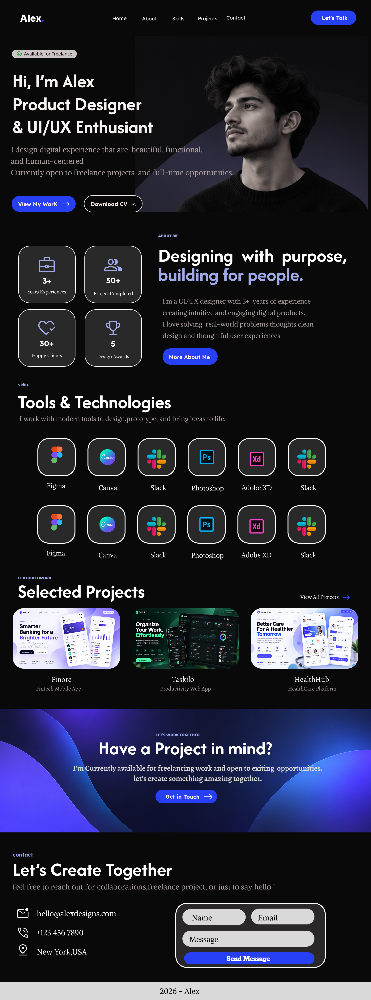

# 🎨 Modern Portfolio Website UI Design

A modern portfolio website UI concept manually designed in Figma,
focusing on dark premium aesthetics, responsive layouts,
typography, visual hierarchy, and polished interface design.

## 🔗 Figma Design

[View the full Figma Design](https://www.figma.com/design/09BthdqbV6jHl34hmeoxJJ/Untitled?node-id=0-1&t=KKab04NwCl9JR4k4-1)
 
[Linkedin](https://lnkd.in/p/gP7ppmR8)
## 🖼️ Preview

## 🎯 Design Focus

- UI Design
- Responsive Web Design
- Typography
- Visual Hierarchy
- Interface Design
- Portfolio Experience
